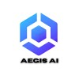
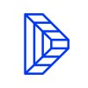

<h1 align="center">Hi, I'm Antoine</h1>

  <b>Software Engineering Student @ Epitech Lyon</b> · 3rd year 
  Building things at the intersection of <b>AI/ML</b>, low-level programming, and hackathons.

  

---

### About me

- I'm a software engineering student at **Epitech Lyon**, currently in my 3rd year.
- Passionate about **AI / Machine Learning** and **Data Science**.
- I enjoy **hackathons** — I built projects at the **Mistral AI MCP Hackathon** and **ETHGlobal Cannes 2025 & 2026**, and many more.
- Comfortable from low-level (Haskell, C) up to modern AI stacks (Python, TypeScript).
- Always exploring new tech and looking for challenging problems to solve.

---

### Tech Stack

**Languages**

**AI / ML**

**Tools**

---

### Experience

 **Digital Forensics Engineering Intern** · National Forensic Science Service (SNPS)  
*Apr 2026 – Present · Écully, France*  
Digital forensics work at the central digital forensics laboratory.

 **Co-Founder & AI Engineer** · Aegis AI  
*Mar 2026 – Present · Lyon, France*  
Co-founded an AI venture; designing and building AI-driven products.

 **Data Scientist (Intern)** · Darwin Data  
*Sep 2025 – Feb 2026 · Remote*  
Data science and analysis work.

 **R&D Developer** · PoC Innovation *(VIE/VIA)*  
*Mar 2025 – Apr 2026*  
Developed a Large Language Model (LLM) to assist ENT doctors, in collaboration with the **Institut Pasteur** and **Cyrebro**.

 **Digital Forensics Engineering Intern** · National Forensic Science Service (SNPS)  
*Jul 2024 – Dec 2024 · 6 months*  
Analyzed iOS biome data and built software to streamline its analysis, at the central digital forensics laboratory.

**Reservist** · French Navy (Marine Nationale)  
*Jan 2023 – Present · Toulon, France*

---

### GitHub Stats

  

  

---

  <i>Reach me on <a href="https://www.linkedin.com/in/antoine-béal-7b1565296">LinkedIn</a></i>

